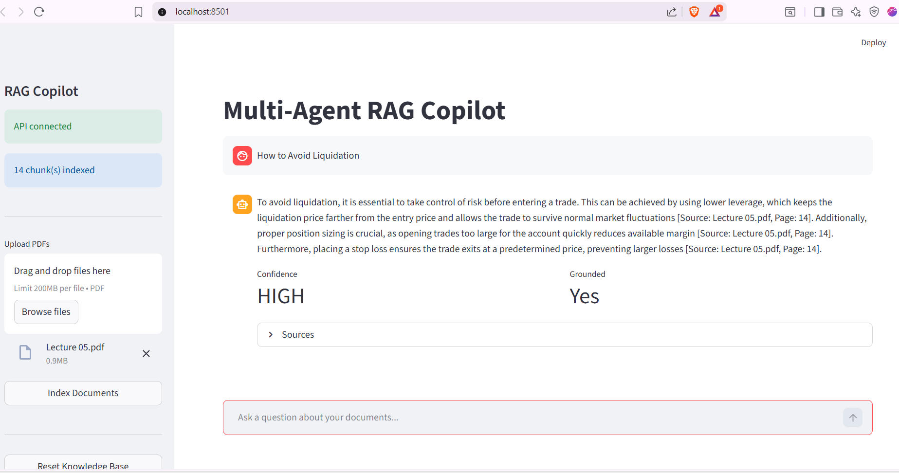

# Multi-Agent RAG Copilot

A document question-answering system built with LangGraph, FAISS, ChromaDB, and Neo4j. Upload PDFs and ask questions — three specialized agents handle retrieval, knowledge graph enrichment, and answer validation.


---



## How it works

Most RAG systems do: search → LLM → answer.

This one routes queries through three agents:

1. **Retriever Agent** — searches FAISS and ChromaDB simultaneously, merges and deduplicates results by relevance score
2. **Graph Agent** — triggered only for relational queries (who, which department, reports to etc.) — queries a Neo4j knowledge graph built from the documents
3. **Validator Agent** — generates the answer using Llama-3.1-8B, then checks whether it's grounded in the retrieved context before returning it

---

## Tech Stack

- **LangGraph** — agent orchestration with conditional routing
- **FAISS** — fast in-memory vector search
- **ChromaDB** — persistent vector store with metadata filtering
- **Neo4j** — knowledge graph for relational queries
- **spaCy** — entity and relation extraction
- **sentence-transformers** — all-mpnet-base-v2 embeddings
- **FastAPI** — REST API backend
- **Streamlit** — chat interface
- **RAGAS** — evaluation pipeline

---

## Project Structure

```
multi_agent_rag/
├── config.py
├── orchestrator.py
├── pipeline/
│   ├── document_processor.py
│   ├── embedder.py
│   ├── faiss_store.py
│   └── graph_builder.py
├── app/
│   ├── main.py
│   └── agents/
│       ├── retriever.py
│       ├── graph_agent.py
│       └── validator.py
├── app.py                  (Streamlit UI)
└── evaluation/
    └── ragas_eval.py
```

---

## Getting Started

### Prerequisites
- Python 3.11
- Docker Desktop
- HuggingFace account (free API token)

### 1. Clone and install
```bash
git clone https://github.com/YOUR_USERNAME/multi-agent-rag.git
cd multi-agent-rag
pip install -r requirements.txt
python -m spacy download en_core_web_sm
```

### 2. Start Neo4j
```bash
docker run -d --name neo4j \
  -p 7474:7474 -p 7687:7687 \
  -e NEO4J_AUTH=neo4j/your_password  \
  neo4j:latest
```

### 3. Set up environment
```bash
cp .env.example .env
# add your HuggingFace token to .env
```

### 4. Run

**Terminal 1:**
```bash
uvicorn app.main:app --reload
```

**Terminal 2:**
```bash
streamlit run app.py
```

Open `http://localhost:8501`, upload a PDF, and start asking questions.

---

## API

| Method | Endpoint | Description |
|--------|----------|-------------|
| GET | `/health` | System status |
| POST | `/upload` | Upload PDFs |
| POST | `/query` | Ask a question |
| DELETE | `/reset` | Clear all indexes |

Interactive docs at `http://localhost:8000/docs`

---

## Evaluation

```bash
python evaluation/ragas_eval.py
```

Measures faithfulness and answer relevancy using RAGAS. Falls back to word-overlap scoring if the HuggingFace API is unavailable.

---

## Results

Evaluated on a 13-question test set using word-overlap scoring (manual fallback):

| Metric | Score |
|--------|-------|
| Faithfulness | 0.63 |
| Answer Relevancy | 0.76 |

Note: Word-overlap scoring underestimates semantic similarity — answers 
using equivalent terms score lower despite being correct. 
Real performance is likely higher.


## License

MIT
